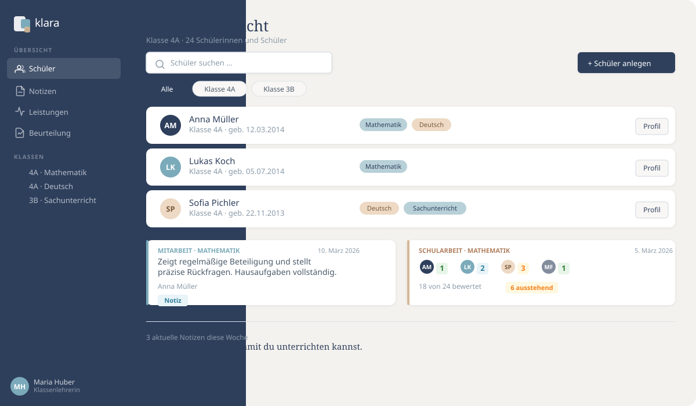

# Klara

[](https://github.com/simonabler/Klara/actions/workflows/ci.yml)

<p align="center">
  
</p>

**Klara** ist ein ruhiges, übersichtliches Werkzeug für Lehrkräfte – entwickelt für den Schulalltag, nicht für die Schulsekretariat.

Statt langer Einführungen und komplizierter Menüs bietet Klara das Wesentliche: Schülerprofile anlegen, Beobachtungen festhalten, Leistungen dokumentieren – alles an einem Ort, ohne Ablenkung.

Ob nach einer Unterrichtsstunde schnell eine Notiz zur Mitarbeit, vor der Notenkonferenz einen Überblick über alle Schularbeiten einer Klasse, oder beim Elterngespräch auf konkrete Beobachtungen zugreifen – Klara ist in Sekunden einsatzbereit.

> Ein digitaler Notizblock mit Struktur. Für Lehrkräfte, die lieber unterrichten als verwalten.

🌐 **[https://klara.abler.tirol](https://klara.abler.tirol)**

---

## Inhalt

- [Produktidee](#produktidee)
- [Stack](#stack)
- [Projektstruktur](#projektstruktur)
- [Lokale Entwicklung](#lokale-entwicklung)
- [Umgebungsvariablen](#umgebungsvariablen)
- [Verfügbare Skripte](#verfügbare-skripte)
- [Architekturprinzipien](#architekturprinzipien)
- [API](#api)

---

## Produktidee

Klara hilft Lehrkräften dabei, schnell und ohne Aufwand folgendes zu dokumentieren:

- **Schülerprofile** – Name, Bild, Geburtsdatum, Elterninformationen
- **Pädagogische Notizen** – Mitarbeit und Verhalten, fachbezogen und chronologisch
- **Leistungsdokumentation** – Schularbeiten, Überprüfungen, Ergebnisse je Schüler
- **Beurteilungsgrundlagen** – übersichtlich abrufbar, ohne automatische Notenlogik (Notendurchschnitt nur, wenn in den Einstellungen aktiviert), Export als Excel
- **Stundenplan** – als Dashboard mit Wochen- und Tagesansicht, A/B-Wochen, Semester- und Einzelterminen

---

## Stack

| Bereich | Technologie |
|---|---|
| Monorepo | [Nx](https://nx.dev) |
| Frontend | [Angular 20](https://angular.dev) mit SSR |
| Backend | [NestJS 11](https://nestjs.com) |
| Datenbank | [PostgreSQL 17](https://www.postgresql.org) |
| ORM | [TypeORM](https://typeorm.io) |
| Containerisierung | Docker / Docker Compose |
| Reverse Proxy | [Traefik](https://traefik.io) mit automatischem TLS (Let's Encrypt) |

---

## Projektstruktur

```
/
├── apps/
│   ├── klara/          # Angular Frontend (SSR)
│   ├── klara-e2e/      # Playwright E2E-Tests (Frontend)
│   ├── server/         # NestJS Backend
│   └── server-e2e/     # E2E-Tests (Backend)
├── libs/
│   └── domain/         # Shared Library: DTOs, Interfaces, Enums
│                       # Import via @app/domain
├── dockerfiles/
│   ├── Dockerfile.backend
│   ├── Dockerfile.frontend
│   └── nginx.conf
├── conf/
│   └── postgres/
│       └── .env.template
├── docker-compose.yml      # Produktion (mit Traefik)
├── docker-compose.dev.yml  # Lokale Entwicklung
├── .github/workflows/ci.yml  # CI: Lint, Tests, Build
└── .env.example
```

### Shared Library `@app/domain`

Die Library `libs/domain` ist die einzige Quelle der Wahrheit für alle geteilten Typen zwischen Frontend und Backend.

```typescript
import { NoteType, AssessmentEventType } from '@app/domain';
```

Sie enthält DTOs und Enums. Beide Apps importieren ausschließlich aus `@app/domain` – keine doppelten Typdefinitionen.

Die Request-Validierung (class-validator) liegt dagegen im Backend in den `*-validation.dto.ts`-Dateien der jeweiligen Module. Die globale `ValidationPipe` läuft mit `whitelist` und `forbidNonWhitelisted` – jedes Feld eines Request-DTOs braucht dort einen Validierungs-Dekorator, sonst wird der Request abgelehnt.

---

## Lokale Entwicklung

### Voraussetzungen

- [Docker](https://www.docker.com) und Docker Compose
- [Node.js 20+](https://nodejs.org) und npm (für Entwicklung ohne Docker; Dockerfiles und CI verwenden Node 24)

### Mit Docker starten

```bash
# 1. Umgebungsvariablen vorbereiten
cp .env.example .env
cp conf/postgres/.env.template conf/postgres/.env
# Werte in beiden Dateien anpassen

# 2. Alle Services starten
docker compose -f docker-compose.dev.yml up --build

# Frontend:  http://localhost
# Backend:   http://localhost/api
# Swagger:   http://localhost/api/docs
# DB:        localhost:5432
```

### Ohne Docker (Entwicklungsmodus)

```bash
npm install

# Backend starten
npx nx serve server

# Frontend starten (separates Terminal)
npx nx serve klara
```

Der Angular Dev-Server proxied `/api` automatisch auf `http://localhost:3000` (siehe `apps/klara/proxy.conf.json`).

Ohne gesetzte `TYPEORM_*`-Variablen nutzt das Backend eine lokale SQLite-Datenbank (`./klara.sqlite`, Schema per `synchronize`).

### Demo-Lehrkraft

Außerhalb von Produktion legt der Seed beim Start eine Demo-Lehrkraft mit Beispieldaten an (Klasse, Fächer, Schüler, Notizen, Leistungen). Ohne Google-Konfiguration meldest du dich über `http://localhost:3000/api/auth/demo` direkt als diese Lehrkraft an. Seed und Demo-Login verwenden dieselbe Identität (`apps/server/src/app/common/demo-teacher.ts`).

---

## Umgebungsvariablen

Kopiere `.env.example` nach `.env` und passe die Werte an:

```env
# Datenbank
TYPEORM_HOST=db
TYPEORM_PORT=5432
TYPEORM_DATABASE=klara
TYPEORM_USERNAME=user
TYPEORM_PASSWORD=dein-passwort
# Nur in der Entwicklung true – in Produktion verweigert das Backend den Start
TYPEORM_SYNC=false
# Migrations beim Start ausführen (Produktion: true)
TYPEORM_MIGRATIONS_RUN=false

# App
NODE_ENV=production
PORT=3000
FRONTEND_URL=https://klara.abler.tirol   # erlaubte CORS-Origin + Redirect nach Login

# Uploads (Avatare)
# Vollständiger Pfad zum Upload-Verzeichnis inkl. Unterordner
UPLOAD_DIR=/data/uploads/avatars

# Auth
GOOGLE_CLIENT_ID=
GOOGLE_CLIENT_SECRET=
GOOGLE_CALLBACK_URL=https://klara.abler.tirol/api/auth/google/callback
JWT_SECRET=change-me-in-production
JWT_EXPIRES_IN=8h
```

Für die Datenbank zusätzlich `conf/postgres/.env` aus dem Template befüllen.

Der Frontend-Container braucht für SSR zusätzlich `BACKEND_URL` (z. B. `http://backend:3000`), siehe `docker-compose.yml`.

---

## Verfügbare Skripte

```bash
# Bauen
npx nx build server      # NestJS Backend bauen
npx nx build klara       # Angular Frontend bauen

# Tests
npx nx test server       # Backend Unit Tests
npx nx test domain       # Shared Library Tests
npx nx test klara        # Frontend Unit Tests

# Linting
npx nx lint server
npx nx lint klara
npx nx lint domain

# Alles auf einmal (wie in der CI)
npx nx run-many -t lint test build --projects=domain,server,klara

# Datenbank-Migrations
npm run migration:generate --name=AddSomething   # aus Entity-Änderungen erzeugen
npm run migration:run
npm run migration:revert
npm run migration:show
```

Schemaänderungen kommen immer über eine Migration in `apps/server/src/migrations/` – nie über `TYPEORM_SYNC` in Produktion.

### CI

Die GitHub Action `.github/workflows/ci.yml` läuft bei jedem Push auf `master` und bei jedem Pull Request: Lint, Unit-Tests und Build für `domain`, `server` und `klara` sowie die Kompilierung der Migrations wie im Backend-Dockerfile.

---

## Architekturprinzipien

**Shared DTOs als Vertragsgarantie**
Alle API-Typen leben in `libs/domain`. Eine Änderung dort bricht sofort Tests in Frontend und Backend – kein stiller Drift zwischen den Schichten.

**MVP-first**
Jede Funktion muss einer Lehrkraft im Alltag direkt helfen. Was das nicht tut, kommt nicht in den MVP.

**Einfachheit vor Vollständigkeit**
Klara ist kein Schulverwaltungssystem. Es ist ein fokussiertes Werkzeug, das Lehrkräfte ohne Einführung sofort verstehen und verwenden können.

---

## API

Das Backend ist unter `/api` erreichbar.

| Umgebung | URL |
|---|---|
| Produktion | `https://klara.abler.tirol/api` |
| Lokal (Docker) | `http://localhost/api` |
| Lokal (ohne Docker) | `http://localhost:3000/api` |

**Swagger-Dokumentation** (nur außerhalb von Produktion aktiv):

```
http://localhost/api/docs            # lokal via Docker
http://localhost:3000/api/docs       # lokal ohne Docker
```

Health-Check: `GET /api/healthz` → `{ "status": "ok" }`

### Endpunkte (Übersicht)

Alle Endpunkte außer Login und Health-Check erfordern das Auth-Cookie.

| Ressource | Pfad |
|---|---|
| Schüler | `/api/students` |
| Avatar-Upload | `POST /api/students/:id/avatar` |
| CSV-Import | `POST /api/students/import`, `POST /api/students/check-duplicates` |
| Klassen | `/api/classes` |
| Fächer | `/api/subjects` |
| Notizen | `/api/notes` |
| Leistungsereignisse | `/api/assessments` |
| Beurteilungstabelle | `GET /api/assessments/table` |
| Schülerergebnisse | `PUT /api/assessments/:id/results`, `GET /api/assessments/student/:studentId/results` |
| Bewertungsschemata | `/api/assessment-types` |
| Stundenplan | `/api/timetable` |
| Login | `GET /api/auth/google`, `GET /api/auth/demo` (nur Entwicklung) |
| Sitzung | `GET /api/auth/me`, `GET /api/auth/logout` |
| Notenberechnung an/aus | `GET/PATCH /api/auth/grading-enabled` |
| Datenexport | `GET /api/auth/export` |
| Konto löschen | `DELETE /api/auth/account` |

---

## Datenschutz (DSGVO)

Klara speichert personenbezogene Daten von Schülerinnen und Schülern (Name, Geburtsdatum, Elterndaten, Noten, Beobachtungen). **Der Betreiber einer Klara-Instanz ist für die datenschutzkonforme Nutzung verantwortlich.**

### Pflichten des Betreibers

- Erstellung einer **Datenschutzerklärung** gemäß Art. 13/14 DSGVO
- Sicherstellung einer **Rechtsgrundlage** für die Verarbeitung (z. B. schulrechtliche Grundlage, Einwilligung)
- Abschluss eines **Auftragsverarbeitungsvertrags (AVV)** mit dem Hosting-Anbieter
- Führen eines **Verzeichnisses von Verarbeitungstätigkeiten** (Art. 30 DSGVO)
- Sicherstellung der **Betroffenenrechte** (siehe unten)

### Betroffenenrechte (Art. 15, 17, 20 DSGVO)

| Recht | Umsetzung in Klara |
|---|---|
| **Auskunft** (Art. 15) | Schülerdaten sind in der App einsehbar; vollständiger Export über `GET /api/auth/export` |
| **Löschung** (Art. 17) | Schüler können einzeln gelöscht werden (inkl. aller verknüpften Daten via CASCADE). Lehrkräfte können ihr Konto unter Einstellungen löschen. |
| **Portabilität** (Art. 20) | Export aller Daten einer Lehrkraft als strukturiertes JSON über `GET /api/auth/export` |

### Technische Maßnahmen

- Alle Schüler-Verknüpfungen (Notizen, Elterndaten, Leistungsergebnisse) sind mit `onDelete: 'CASCADE'` konfiguriert – ein gelöschter Schüler hinterlässt keine verwaisten Datensätze
- Beim Löschen einer Lehrkraft werden via CASCADE alle Schüler, Notizen und Leistungsdaten dieser Lehrkraft mitgelöscht
- Authentifizierung via httpOnly-Cookie (kein Token in URL oder localStorage)
- `TYPEORM_SYNC` ist in Produktion deaktiviert (kein unbeabsichtigter Datenverlust)

---

## Lizenz

MIT – siehe [LICENSE.md](LICENSE.md)
